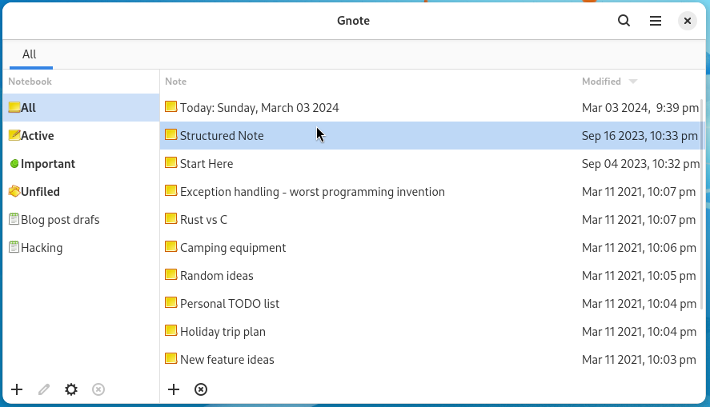

# Gnote

Gnote is a simple note-taking application for GNOME desktop environment. It allows you to capture your ideas, link them together using WikiWiki-style links, group together in notebooks and some extra features for everyday use.

Notes can be printed or exported as HTML documents.

Gnote also supports synchronization, making it simple to use it on multiple devices.

[Gnote User Manual](https://help.gnome.org/users/gnote/stable/)

## Source code can be downloaded from GNOME [downloads](http://ftp.gnome.org/pub/GNOME/sources/gnote/).

## Software Packages

* Fedora: includes Gnote as rpm and as flatpak. Use Gnome Software or dnf to install it.
* Debian: includes Gnote in stable and unstable. Use Synaptic or apt-get to install it.
* Ubuntu: includes Gnote among it's packages. Use Software Center or apt-get to install it.
* Arch Linux has Gnote available, to install: 
`pacman -Syu gnote`
* OpenSUSE: includes Gnote among it's packages. Use YaST to install it.

## Source code

The source code is currently hosted by GNOME in [Gitlab](https://gitlab.gnome.org/GNOME/gnote).

## Reporting bugs

Submit issue in [Gitlab](https://gitlab.gnome.org/GNOME/gnote/issues).

## Submitting patches

Fork Gnote git repository and create a pull request.

## Getting help

Use tag `Gnote` for your question in GNOME [Discourse](https://discourse.gnome.org/).

